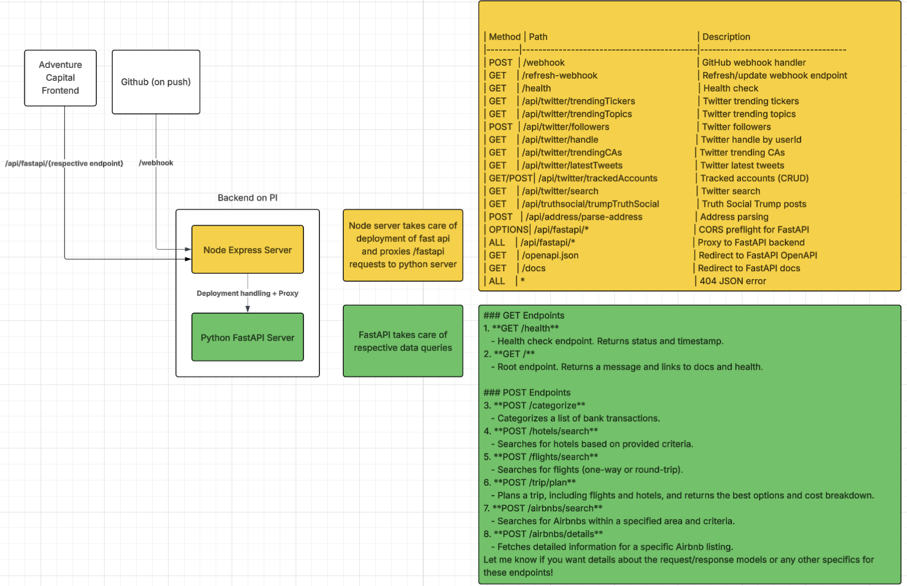

# AC-Backend

[](https://github.com/jongan69/AC-Backend/actions/workflows/refresh-webhook.yml)



## Overview
AC-Backend is a FastAPI-based backend for travel planning, providing endpoints for searching hotels, flights, Airbnbs, categorizing transactions, and planning trips with cost breakdowns.

---

## API Endpoints

### Health & Root

#### `GET /health`
- **Description:** Health check endpoint.
- **Response:** `{ "status": "healthy", "timestamp": <ISO8601> }`

#### `GET /`
- **Description:** Root endpoint. Returns a welcome message and links to docs and health.
- **Response:** `{ "message": "Travel API is running", "docs": "/docs", "health": "/health" }`

---

### Transaction Categorization

#### `POST /categorize`
- **Description:** Categorizes a list of bank transactions.
- **Request Body:**
  ```json
  {
    "transactions": [
      { "Description": "string" },
      ...
    ]
  }
  ```
- **Response:**
  ```json
  {
    "results": [
      {
        "index": 0,
        "Description": "string",
        "Category": "string",
        "Sub_Category": "string",
        "Category_Confidence": 0.95,
        "Sub_Category_Confidence": 0.92
      },
      ...
    ]
  }
  ```

---

### Hotel Search

#### `POST /hotels/search`
- **Description:** Searches for hotels based on provided criteria.
- **Request Body:**
  ```json
  {
    "checkin_date": "YYYY-MM-DD",
    "checkout_date": "YYYY-MM-DD",
    "location": "string",
    "adults": 1,
    "children": 0,
    "infants": 0,
    "room_type": "standard",
    "amenities": ["wifi", "breakfast"],
    "fetch_mode": "fallback",
    "limit": 3,
    "debug": false
  }
  ```
- **Response:**
  ```json
  {
    "hotels": [
      {
        "name": "string",
        "price": 120.0,
        "rating": 4.5,
        "url": "string",
        "amenities": ["wifi", "breakfast"]
      },
      ...
    ],
    "lowest_price": 100.0,
    "current_price": 120.0
  }
  ```

---

### Flight Search

#### `POST /flights/search`
- **Description:** Searches for flights (one-way or round-trip).
- **Request Body:**
  ```json
  {
    "date": "YYYY-MM-DD",
    "from_airport": "IATA",
    "to_airport": "IATA",
    "trip": "one-way",
    "seat": "economy",
    "adults": 1,
    "children": 0,
    "infants_in_seat": 0,
    "infants_on_lap": 0,
    "fetch_mode": "fallback",
    "return_date": "YYYY-MM-DD" // required for round-trip
  }
  ```
- **Response (one-way):**
  ```json
  {
    "flights": [
      {
        "name": "string",
        "departure": "string",
        "arrival": "string",
        "arrival_time_ahead": "+1",
        "duration": "4h 30m",
        "stops": 0,
        "delay": "string",
        "price": 350.0,
        "is_best": true,
        "url": "string"
      },
      ...
    ],
    "current_price": "350.0"
  }
  ```
- **Response (round-trip):**
  ```json
  {
    "outbound_flights": [ ... ],
    "return_flights": [ ... ],
    "current_price": "700.0"
  }
  ```

---

### Trip Planning

#### `POST /trip/plan`
- **Description:** Plans a trip, including flights and hotels, and returns the best options and cost breakdown.
- **Request Body:**
  ```json
  {
    "origin": "IATA",
    "destination": "IATA",
    "depart_date": "YYYY-MM-DD",
    "return_date": "YYYY-MM-DD",
    "adults": 1,
    "children": 0,
    "infants": 0,
    "hotel_preferences": {
      "star_rating": 3,
      "max_price_per_night": 150.0,
      "amenities": ["Free Wi-Fi", "Breakfast ($)"]
    },
    "room_type": "standard",
    "amenities": ["wifi", "breakfast"],
    "max_total_budget": 3000.0
  }
  ```
- **Response:**
  ```json
  {
    "best_outbound_flight": { ... },
    "best_return_flight": { ... },
    "best_hotel": { ... },
    "total_estimated_cost": 2500.0,
    "per_person_per_day": 200.0,
    "breakdown": {
      "flight": 1500.0,
      "hotel": 1000.0,
      "nights": 5,
      "adults": 2,
      "children": 0
    },
    "suggestions": "Consider adjusting your dates...",
    "warning": "Partial results due to timeout."
  }
  ```

---

### Airbnb Search

#### `POST /airbnbs/search`
- **Description:** Searches for Airbnbs within a specified area and criteria.
- **Request Body:**
  ```json
  {
    "check_in": "YYYY-MM-DD",
    "check_out": "YYYY-MM-DD",
    "ne_lat": 35.0,
    "ne_long": 139.0,
    "sw_lat": 34.0,
    "sw_long": 138.0,
    "zoom_value": 2,
    "price_min": 0,
    "price_max": 0,
    "place_type": "Entire home/apt",
    "amenities": [1, 2],
    "currency": "USD",
    "language": "en",
    "proxy_url": "",
    "limit": 10
  }
  ```
- **Response:**
  ```json
  {
    "airbnbs": [
      {
        "room_id": 123456,
        "name": "string",
        "title": "string",
        "price": 200.0,
        "per_night": 100.0,
        "url": "string",
        "rating": 4.8,
        "review_count": 50,
        "images": ["url1", "url2"],
        "badges": ["Superhost"],
        "latitude": 35.0,
        "longitude": 139.0
      },
      ...
    ],
    "lowest_price": 100.0,
    "current_price": 100.0
  }
  ```

---

### Airbnb Details

#### `POST /airbnbs/details`
- **Description:** Fetches detailed information for a specific Airbnb listing.
- **Request Body:**
  ```json
  {
    "room_id": 123456,
    "currency": "USD",
    "language": "en",
    "proxy_url": ""
  }
  ```
- **Response:**
  ```json
  {
    "name": "string",
    "url": "string",
    "rating": 4.8,
    "amenities": ["Wi-Fi", "Kitchen"],
    "images": ["url1", "url2"],
    "review_count": 50,
    "description": "string",
    "location": { ... },
    "host_name": "string",
    "is_superhost": true
  }
  ```

---

## Running the Server

1. Install dependencies:
   ```bash
   pip install -r requirements.txt
   ```
2. Start the server:
   ```bash
   uvicorn api:app --reload
   ```
3. Visit [http://localhost:8000/docs](http://localhost:8000/docs) for interactive API docs.

---

## Project Structure
- `api.py`: Main FastAPI app and endpoints
- `utils/`: Utility modules (data prep, model, etc.)
- `scripts/`: Data processing and training scripts
- `images/structure.png`: Project structure diagram

---

## License
MIT
